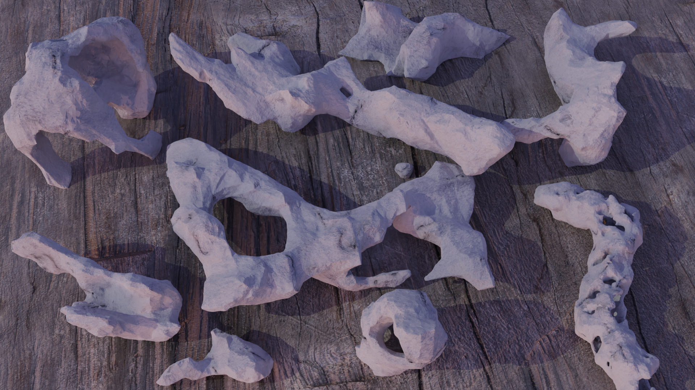

## Intro

Blender (3.1.2) Python procedural models for generating rocks and pillars.

## Rocks

Idea is to populate volume with simple elements (e.g., spheres and cubes) and to remesh them to obtain rock object. 

Shape of the volume, shape and orientation of the simple elements inside of volume and remeshing procedure greatly defines final geometry.

In the simplest case, rocks can be generated by sampling cube volume, generating cubes and spheres on those positions and performing multiple remeshing.

More involved approach is to draw lines (i.g., merging cube into vertex and extruding vertices) which are used for guided rock building. Line is then sampled, on each sample cube is positioned and its volume is sampled. For each sample, cubes and spheres are generated on those positions and performing multiple remeshing results in a rock.

It is important to highlight the importance of remeshing. As we start with very regular elements such as cubes and spheres, remeshing introduces errors and desired complexity. Therefore, it is important to remesh first with the lower quality to introduce errors, and then remesh with higher quality to obtain uniform mesh surface.

## Pillars

Pillars can be generated on regular grid or weight paint is applied on base mesh and used for positioning the pillar elements.

## Examples

Using this code, I have created rocks and pillars for the following scenes:

Thanks to https://polyhaven.com/ for fantastic textures and HDRIs!

Water was created using Blender Ocean modifier.

More of my work available here: https://www.artstation.com/lovro
